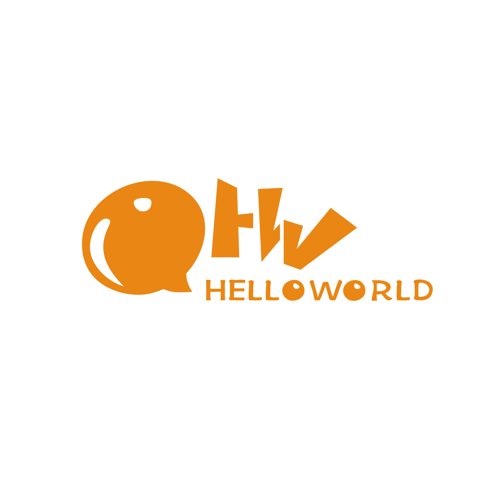

# 招新网站任务清单
> 基于Webpack + Vue2开发的招新网站

## 开发任务
- [ ] 报名表单前端页面
- [ ] 表单前端验证功能
- [ ] 社团介绍
- [ ] 其他宣传材料
- [ ] 使用响应式布局
- [ ] CCF介绍
- [ ] 杭州电子科技大学学生分会介绍

✅**在确保功能完整的情况下请同时使页面美观**

## 其他想法（个人想法）
1. 可以添加小游戏/隐藏彩蛋等元素获取小奖品/入群链接等
2. 每个部门的部门宣传内容可以与相关部长/行政部长讨论
3. 添加能增加用户体验的动画效果
4. CCF页面资料可以从CCF官网扒
5. 一些花里胡哨的功能如：力扣每日一题

## 注意事项
+ ~~一定要能用啊！！！~~
+ 技术问题可以问划水中的社长同学
+ 相应开发任务完成后请在复选框中打上勾
+ 服务器地址以及登录用户名密码见群

## 分工安排
+ 表单页面/组件
  + 表单设计与前端验证 - 陈慧😕
  + 表单页面布局与表单出现动画 - 靳一鸣🙁
+ 宣传界面
  + 整体风格设计（负责所有页面的布局以确保整体风格一致）- 徐壮😭
  + 前端部门宣传（只写组件内容，不写样式。下同） - 陈慧😕
  + 人工智能部门宣传 - 徐壮😭
  + 行政部门宣传 - 徐壮😭
  + 后端部门宣传 - 徐壮😭
+ CCF界面 - 王磊😱

## 参考网站
- <a href="https://www.monyun.cn/">💬短信API接口</a>
- <a href="https://developer.mozilla.org/zh-CN/docs/Web">💗MDN</a>
